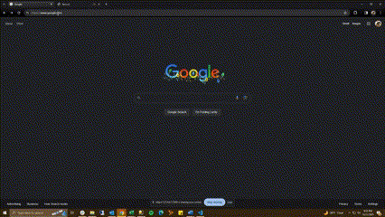

# ScreenRecording Chrome Extensions

> Extension that allows for recording of screen. The need and utility of the extension became 
> obvious as developed apps and needed to quickly display their functionality in gif format.
> This project allowed me to become more comfortable with APIs involved in creating media.
> 
> Live demo [_here_](https://shouwangh.github.io/weather-app-react/). 

## Table of Contents
* [General Info](#general-information)
* [Technologies Used](#technologies-used)
* [Acknowledgements](#acknowledgements)
* [Contact](#contact)

## General Information
> The extension use the MediaRecorder API to manipulate MediaStream objects. There
> is also basic javascript to allow the buttons to visually change as media starts being recorded
> or when media is ready to be downloaded.
> Additional functionality may be added to allow for naming of the captured stream as well as saving of
> different filetypes
> 

## Technologies Used

## Contact
- Feel free to peruse other projects or contact me below.

